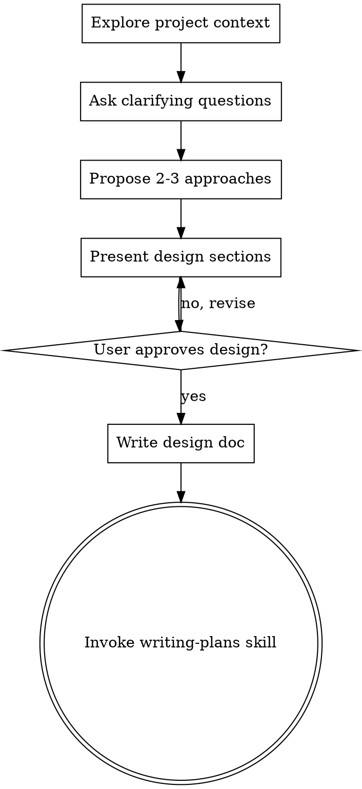

# Brainstorming Ideas Into Designs

## Overview

Help turn ideas into fully formed designs and specs through natural collaborative dialogue.

Start by understanding the current project context, then ask questions one at a time to refine the idea. Once you understand what you're building, present the design and get user approval.

<HARD-GATE>
Do NOT invoke any implementation skill, write any code, scaffold any project, or take any implementation action until you have presented a design and the user has approved it. This applies to EVERY project regardless of perceived simplicity.
</HARD-GATE>

- Leverage native parallel subagent dispatch and 200k+ context windows where available.

## Anti-Pattern: "This Is Too Simple To Need A Design"

Every project goes through this process. A todo list, a single-function utility, a config change — all of them. "Simple" projects are where unexamined assumptions cause the most wasted work. The design can be short (a few sentences for truly simple projects), but you MUST present it and get approval.

## Anti-Patterns

- Delegating or evaluating without a scoped success condition: The output becomes hard to review and easy to overbuild.
- Skipping the evidence step: A workflow that cannot be re-checked quickly is not ready for handoff.
- Bundling unrelated subtasks together: It creates noisy prompts, weaker ownership, and avoidable integration risk.

## Verification Protocol

Before claiming "skill applied successfully":

1. Pass/fail: The Brainstorming workflow starts from explicit success criteria, constraints, and stop conditions.
2. Pass/fail: Required evidence is collected before any completion, approval, or readiness claim.
3. Pass/fail: The next action follows the documented gate order without skipping review or verification steps.
4. Pressure-test scenario: Apply the workflow under time pressure with one failing check and one tempting shortcut.
5. Success metric: Zero rationalizations; blocked, failed, or unverified work is reported as such.

## Checklist

You MUST create a task for each of these items and complete them in order:

1. **Explore project context** — check files, docs, recent commits
2. **Ask clarifying questions** — one at a time, understand purpose/constraints/success criteria
3. **Propose 2-3 approaches** — with trade-offs and your recommendation
4. **Present design** — in sections scaled to their complexity, get user approval after each section
5. **Write design doc** — save to `docs/plans/YYYY-MM-DD-<topic>-design.md` and commit
6. **Transition to implementation** — invoke writing-plans skill to create implementation plan

## Process Flow

**The terminal state is invoking writing-plans.** Do NOT invoke frontend-design, mcp-builder, or any other implementation skill. The ONLY skill you invoke after brainstorming is writing-plans.

## The Process

**Understanding the idea:**
- Check out the current project state first (files, docs, recent commits)
- Ask questions one at a time to refine the idea
- Prefer multiple choice questions when possible, but open-ended is fine too
- Only one question per message - if a topic needs more exploration, break it into multiple questions
- Focus on understanding: purpose, constraints, success criteria

**Exploring approaches:**
- Propose 2-3 different approaches with trade-offs
- Present options conversationally with your recommendation and reasoning
- Lead with your recommended option and explain why

**Presenting the design:**
- Once you believe you understand what you're building, present the design
- Scale each section to its complexity: a few sentences if straightforward, up to 200-300 words if nuanced
- Ask after each section whether it looks right so far
- Cover: architecture, components, data flow, error handling, testing
- Be ready to go back and clarify if something doesn't make sense

## After the Design

**Documentation:**
- Write the validated design to `docs/plans/YYYY-MM-DD-<topic>-design.md`
- Use elements-of-style:writing-clearly-and-concisely skill if available
- Commit the design document to git

**Implementation:**
- Invoke the writing-plans skill to create a detailed implementation plan
- Do NOT invoke any other skill. writing-plans is the next step.

## Key Principles

- **One question at a time** - Don't overwhelm with multiple questions
- **Multiple choice preferred** - Easier to answer than open-ended when possible
- **YAGNI ruthlessly** - Remove unnecessary features from all designs
- **Explore alternatives** - Always propose 2-3 approaches before settling
- **Incremental validation** - Present design, get approval before moving on
- **Be flexible** - Go back and clarify when something doesn't make sense

<!-- PORTABILITY:START -->
## Cross-Client Portability

This skill is written to stay usable across GitHub Copilot, Claude Code, Codex, and Gemini CLI.

- GitHub Copilot: keep the folder in a Copilot-visible skill or plugin path, or wrap the workflow as project instructions if the host does not support portable skill folders directly.
- Claude Code: keep the folder in a local skills directory or a compatible plugin or marketplace source.
- Codex: install or sync the folder into `$CODEX_HOME/skills/<skill-name>` and restart Codex after major changes.
- Gemini CLI: this repository generates a project command named `/skills:brainstorming` from this skill. Rebuild commands with `python scripts/export-gemini-skill.py brainstorming` and then run `/commands reload` inside Gemini CLI.

<!-- PORTABILITY:END -->

<!-- MCP:START -->
## MCP Availability And Fallback

Preferred MCP Server: None required

- Fallback prompt: "Use the Brainstorming Ideas Into Designs skill without MCP. Rely on the local `SKILL.md`, bundled references or scripts, and manual verification. Show the exact commands, evidence, and final checks you used before concluding."
- If the current host does not expose a matching server, use the bundled references, scripts, native toolchain, and manual workflow already described in this skill.
- Treat direct local verification, rendered output, logs, tests, or screenshots as the fallback evidence path before completion.

<!-- MCP:END -->

## Related Skills

- [agent-task-mapping](../agent-task-mapping/SKILL.md): Use it when the workflow also needs task-to-agent routing decisions.
- [custom-agent-usage](../custom-agent-usage/SKILL.md): Use it when the workflow also needs loading and invoking custom agent definitions safely.
- [subagent-delegation](../subagent-delegation/SKILL.md): Use it when the workflow also needs safe, scoped delegation to helper agents.
- [subagent-driven-development](../subagent-driven-development/SKILL.md): Use it when the workflow also needs plan-driven implementation with reviewer loops.
