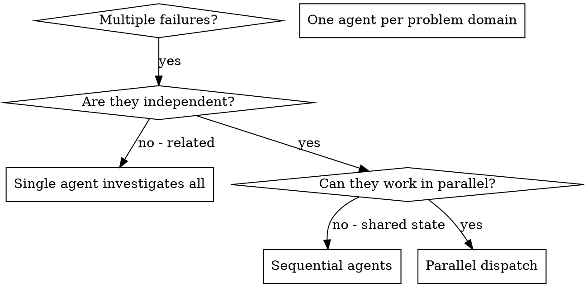

# Dispatching Parallel Agents

## Overview

When you have multiple unrelated failures (different test files, different subsystems, different bugs), investigating them sequentially wastes time. Each investigation is independent and can happen in parallel.

**Core principle:** Dispatch one agent per independent problem domain. Let them work concurrently.

- Leverage native parallel subagent dispatch and 200k+ context windows where available.

## When to Use

Use symptom -> action triggers: when one matches, apply this skill and verify with the protocol below.



**Use when:**
- 3+ test files failing with different root causes
- Multiple subsystems broken independently
- Each problem can be understood without context from others
- No shared state between investigations

**Don't use when:**
- Failures are related (fix one might fix others)
- Need to understand full system state
- Agents would interfere with each other

## The Pattern

### 1. Identify Independent Domains

Group failures by what's broken:
- File A tests: Tool approval flow
- File B tests: Batch completion behavior
- File C tests: Abort functionality

Each domain is independent - fixing tool approval doesn't affect abort tests.

### 2. Create Focused Agent Tasks

Each agent gets:
- **Specific scope:** One test file or subsystem
- **Clear goal:** Make these tests pass
- **Constraints:** Don't change other code
- **Expected output:** Summary of what you found and fixed

### 3. Dispatch in Parallel

```typescript
// In Claude Code / AI environment
Task("Fix agent-tool-abort.test.ts failures")
Task("Fix batch-completion-behavior.test.ts failures")
Task("Fix tool-approval-race-conditions.test.ts failures")
// All three run concurrently
```

### 4. Review and Integrate

When agents return:
- Read each summary
- Verify fixes don't conflict
- Run full test suite
- Integrate all changes

## Agent Prompt Structure

Good agent prompts are:
1. **Focused** - One clear problem domain
2. **Self-contained** - All context needed to understand the problem
3. **Specific about output** - What should the agent return?

```markdown
Fix the 3 failing tests in src/agents/agent-tool-abort.test.ts:

1. "should abort tool with partial output capture" - expects 'interrupted at' in message
2. "should handle mixed completed and aborted tools" - fast tool aborted instead of completed
3. "should properly track pendingToolCount" - expects 3 results but gets 0

These are timing/race condition issues. Your task:

1. Read the test file and understand what each test verifies
2. Identify root cause - timing issues or actual bugs?
3. Fix by:
   - Replacing arbitrary timeouts with event-based waiting
   - Fixing bugs in abort implementation if found
   - Adjusting test expectations if testing changed behavior

Do NOT just increase timeouts - find the real issue.

Return: Summary of what you found and what you fixed.
```

## Common Mistakes

**❌ Too broad:** "Fix all the tests" - agent gets lost
**✅ Specific:** "Fix agent-tool-abort.test.ts" - focused scope

**❌ No context:** "Fix the race condition" - agent doesn't know where
**✅ Context:** Paste the error messages and test names

**❌ No constraints:** Agent might refactor everything
**✅ Constraints:** "Do NOT change production code" or "Fix tests only"

**❌ Vague output:** "Fix it" - you don't know what changed
**✅ Specific:** "Return summary of root cause and changes"

## When NOT to Use

**Related failures:** Fixing one might fix others - investigate together first
**Need full context:** Understanding requires seeing entire system
**Exploratory debugging:** You don't know what's broken yet
**Shared state:** Agents would interfere (editing same files, using same resources)

## Anti-Patterns

- Delegating or evaluating without a scoped success condition: The output becomes hard to review and easy to overbuild.
- Skipping the evidence step: A workflow that cannot be re-checked quickly is not ready for handoff.
- Bundling unrelated subtasks together: It creates noisy prompts, weaker ownership, and avoidable integration risk.

## Verification Protocol

Before claiming "skill applied successfully":

1. Pass/fail: The Dispatching Parallel Agents workflow names the agent boundary, delegated scope, and expected return artifact.
2. Pass/fail: Context passed to helpers is minimal, task-local, and free of hidden expected answers.
3. Pass/fail: Results are integrated only after evidence, diffs, or citations are checked by the controller.
4. Pressure-test scenario: Run the workflow on two similar tasks that must not share assumptions or leaked context.
5. Success metric: Zero context leakage; every delegated output is independently reviewable.


## Real Example from Session

**Scenario:** 6 test failures across 3 files after major refactoring

**Failures:**
- agent-tool-abort.test.ts: 3 failures (timing issues)
- batch-completion-behavior.test.ts: 2 failures (tools not executing)
- tool-approval-race-conditions.test.ts: 1 failure (execution count = 0)

**Decision:** Independent domains - abort logic separate from batch completion separate from race conditions

**Dispatch:**
```
Agent 1 → Fix agent-tool-abort.test.ts
Agent 2 → Fix batch-completion-behavior.test.ts
Agent 3 → Fix tool-approval-race-conditions.test.ts
```

**Results:**
- Agent 1: Replaced timeouts with event-based waiting
- Agent 2: Fixed event structure bug (threadId in wrong place)
- Agent 3: Added wait for async tool execution to complete

**Integration:** All fixes independent, no conflicts, full suite green

**Time saved:** 3 problems solved in parallel vs sequentially

## Key Benefits

1. **Parallelization** - Multiple investigations happen simultaneously
2. **Focus** - Each agent has narrow scope, less context to track
3. **Independence** - Agents don't interfere with each other
4. **Speed** - 3 problems solved in time of 1

## Verification

After agents return:
1. **Review each summary** - Understand what changed
2. **Check for conflicts** - Did agents edit same code?
3. **Run full suite** - Verify all fixes work together
4. **Spot check** - Agents can make systematic errors

## Real-World Impact

From debugging session (2025-10-03):
- 6 failures across 3 files
- 3 agents dispatched in parallel
- All investigations completed concurrently
- All fixes integrated successfully
- Zero conflicts between agent changes

<!-- PORTABILITY:START -->
## Cross-Client Portability

This skill is written to stay usable across GitHub Copilot, Claude Code, Codex, and Gemini CLI.

- GitHub Copilot: keep the folder in a Copilot-visible skill or plugin path, or wrap the workflow as project instructions if the host does not support portable skill folders directly.
- Claude Code: keep the folder in a local skills directory or a compatible plugin or marketplace source.
- Codex: install or sync the folder into `$CODEX_HOME/skills/<skill-name>` and restart Codex after major changes.
- Gemini CLI: this repository generates a project command named `/skills:dispatching-parallel-agents` from this skill. Rebuild commands with `python scripts/export-gemini-skill.py dispatching-parallel-agents` and then run `/commands reload` inside Gemini CLI.

<!-- PORTABILITY:END -->

<!-- MCP:START -->
## MCP Availability And Fallback

Preferred MCP Server: None required

- Fallback prompt: "Use the Dispatching Parallel Agents skill without MCP. Rely on the local `SKILL.md`, bundled references or scripts, and manual verification. Show the exact commands, evidence, and final checks you used before concluding."
- If the current host does not expose a matching server, use the bundled references, scripts, native toolchain, and manual workflow already described in this skill.
- Treat direct local verification, rendered output, logs, tests, or screenshots as the fallback evidence path before completion.

<!-- MCP:END -->

## Related Skills

- [agent-task-mapping](../agent-task-mapping/SKILL.md): Use it when the workflow also needs task-to-agent routing decisions.
- [custom-agent-usage](../custom-agent-usage/SKILL.md): Use it when the workflow also needs loading and invoking custom agent definitions safely.
- [subagent-delegation](../subagent-delegation/SKILL.md): Use it when the workflow also needs safe, scoped delegation to helper agents.
- [subagent-driven-development](../subagent-driven-development/SKILL.md): Use it when the workflow also needs plan-driven implementation with reviewer loops.
