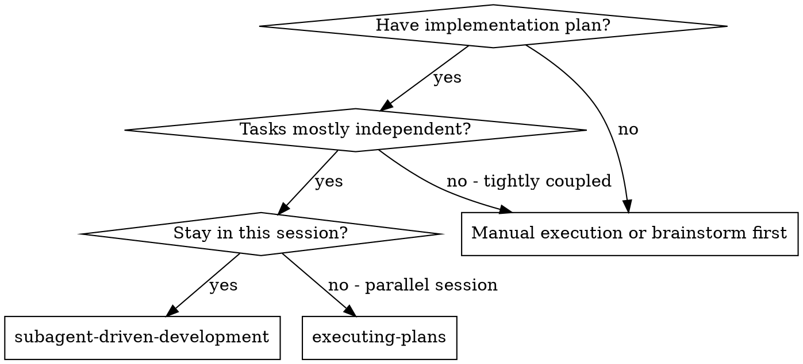
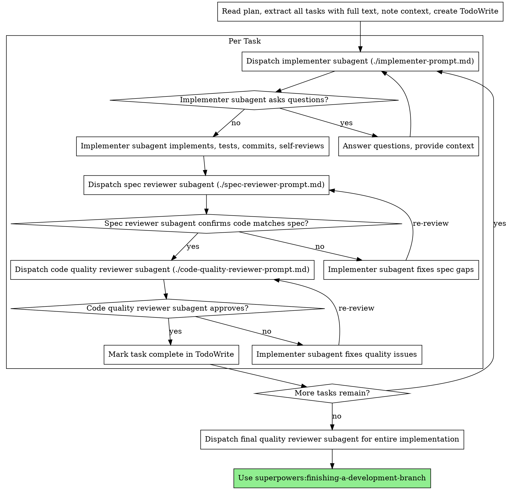

# Subagent-Driven Development

Execute plan by dispatching fresh subagent per task, with two-stage review after each: spec compliance review first, then code quality review.

**Core principle:** Fresh subagent per task + two-stage review (spec then quality) = high quality, fast iteration

- Leverage native parallel subagent dispatch and 200k+ context windows where available.


## When to Use

Use symptom -> action triggers: when one matches, apply this skill and verify with the protocol below.



**vs. Executing Plans (parallel session):**
- Same session (no context switch)
- Fresh subagent per task (no context pollution)
- Two-stage review after each task: spec compliance first, then code quality
- Faster iteration (no human-in-loop between tasks)

## The Process



## Prompt Templates

- [implementer-prompt.md](./implementer-prompt.md) - Dispatch implementer subagent
- [spec-reviewer-prompt.md](./spec-reviewer-prompt.md) - Dispatch spec compliance reviewer subagent
- [code-quality-reviewer-prompt.md](./code-quality-reviewer-prompt.md) - Dispatch code quality reviewer subagent

**Prompt Evolution:** When review loops reveal recurring misses, update the smallest affected prompt template first, then rerun the same task pressure scenario before changing the main workflow.

## Anti-Patterns

- Delegating or evaluating without a scoped success condition: The output becomes hard to review and easy to overbuild.
- Skipping the evidence step: A workflow that cannot be re-checked quickly is not ready for handoff.
- Bundling unrelated subtasks together: It creates noisy prompts, weaker ownership, and avoidable integration risk.
- Context leakage across tasks: Reusing prior task assumptions makes independent subagents silently inherit stale constraints.

## Verification Protocol

Before claiming "skill applied successfully":

1. Pass/fail: The Subagent Driven Development workflow names the agent boundary, delegated scope, and expected return artifact.
2. Pass/fail: Context passed to helpers is minimal, task-local, and free of hidden expected answers.
3. Pass/fail: Results are integrated only after evidence, diffs, or citations are checked by the controller.
4. Pressure-test scenario: Run the workflow on two similar tasks that must not share assumptions or leaked context.
5. Success metric: Zero context leakage; every delegated output is independently reviewable.


## Example Workflow

```
You: I'm using Subagent-Driven Development to execute this plan.

[Read plan file once: docs/plans/feature-plan.md]
[Extract all 5 tasks with full text and context]
[Create TodoWrite with all tasks]

Task 1: Hook installation script

[Get Task 1 text and context (already extracted)]
[Dispatch implementation subagent with full task text + context]

Implementer: "Before I begin - should the hook be installed at user or system level?"

You: "User level (~/.config/superpowers/hooks/)"

Implementer: "Got it. Implementing now..."
[Later] Implementer:
  - Implemented install-hook command
  - Added tests, 5/5 passing
  - Self-review: Found I missed --force flag, added it
  - Committed

[Dispatch spec compliance reviewer]
Spec reviewer: ✅ Spec compliant - all requirements met, nothing extra

[Get git SHAs, dispatch code quality reviewer]
Code reviewer: Strengths: Good test coverage, clean. Issues: None. Approved.

[Mark Task 1 complete]

Task 2: Recovery modes

[Get Task 2 text and context (already extracted)]
[Dispatch implementation subagent with full task text + context]

Implementer: [No questions, proceeds]
Implementer:
  - Added verify/repair modes
  - 8/8 tests passing
  - Self-review: All good
  - Committed

[Dispatch spec compliance reviewer]
Spec reviewer: ❌ Issues:
  - Missing: Progress reporting (spec says "report every 100 items")
  - Extra: Added --json flag (not requested)

[Implementer fixes issues]
Implementer: Removed --json flag, added progress reporting

[Spec reviewer reviews again]
Spec reviewer: ✅ Spec compliant now

[Dispatch code quality reviewer]
Code reviewer: Strengths: Solid. Issues (Important): Magic number (100)

[Implementer fixes]
Implementer: Extracted PROGRESS_INTERVAL constant

[Code reviewer reviews again]
Code reviewer: ✅ Approved

[Mark Task 2 complete]

...

[After all tasks]
[Dispatch final code-reviewer]
Final reviewer: All requirements met, ready to merge

Done!
```

## Advantages

| Comparison | Manual sequential execution | Subagent-driven execution |
|------------|-----------------------------|---------------------------|
| Review coverage per task | Usually 0-1 self-checks | 2 explicit gates: spec compliance, then code quality |

**vs. Manual execution:**
- Subagents follow TDD naturally
- Fresh context per task (no confusion)
- Parallel-safe (subagents don't interfere)
- Subagent can ask questions (before AND during work)

**vs. Executing Plans:**
- Same session (no handoff)
- Continuous progress (no waiting)
- Review checkpoints automatic

**Efficiency gains:**
- No file reading overhead (controller provides full text)
- Controller curates exactly what context is needed
- Subagent gets complete information upfront
- Questions surfaced before work begins (not after)

**Quality gates:**
- Self-review catches issues before handoff
- Two-stage review: spec compliance, then code quality
- Review loops ensure fixes actually work
- Spec compliance prevents over/under-building
- Code quality ensures implementation is well-built

**Cost:**
- More subagent invocations (implementer + 2 reviewers per task)
- Controller does more prep work (extracting all tasks upfront)
- Review loops add iterations
- But catches issues early (cheaper than debugging later)

## Red Flags

**Never:**
- Start implementation on main/master branch without explicit user consent
- Skip reviews (spec compliance OR code quality)
- Proceed with unfixed issues
- Dispatch multiple implementation subagents in parallel (conflicts)
- Make subagent read plan file (provide full text instead)
- Skip scene-setting context (subagent needs to understand where task fits)
- Ignore subagent questions (answer before letting them proceed)
- Accept "close enough" on spec compliance (spec reviewer found issues = not done)
- Skip review loops (reviewer found issues = implementer fixes = review again)
- Let implementer self-review replace actual review (both are needed)
- **Start code quality review before spec compliance is ✅** (wrong order)
- Move to next task while either review has open issues

**If subagent asks questions:**
- Answer clearly and completely
- Provide additional context if needed
- Don't rush them into implementation

**If reviewer finds issues:**
- Implementer (same subagent) fixes them
- Reviewer reviews again
- Repeat until approved
- Don't skip the re-review

**If subagent fails task:**
- Dispatch fix subagent with specific instructions
- Don't try to fix manually (context pollution)

## Self-Verification Phase-Gate Questions

Before you claim the branch is ready, the coordinating agent must ask:

- Did every task pass spec-compliance review before it entered code-quality review?
- Did the implementer fix every open reviewer issue and receive the required re-review afterward?
- Do the Todo states, tests, and final reviewer notes all agree on what is complete versus still open?
- Can another engineer inspect the task history and see why the branch is safe to merge without replaying the whole session?

## Integration

**Required workflow skills:**
- **superpowers:using-git-worktrees** - REQUIRED: Set up isolated workspace before starting
- **superpowers:writing-plans** - Creates the plan this skill executes
- **superpowers:requesting-code-review** - two-stage review (spec compliance first, then code quality) template for reviewer subagents
- **superpowers:finishing-a-development-branch** - Complete development after all tasks

**Subagents should use:**
- **superpowers:test-driven-development** - Subagents follow TDD for each task

**Alternative workflow:**
- **superpowers:executing-plans** - Use for parallel session instead of same-session execution

<!-- PORTABILITY:START -->
## Cross-Client Portability

This skill is written to stay usable across GitHub Copilot, Claude Code, Codex, and Gemini CLI.

- GitHub Copilot: keep the folder in a Copilot-visible skill or plugin path, or wrap the workflow as project instructions if the host does not support portable skill folders directly.
- Claude Code: keep the folder in a local skills directory or a compatible plugin or marketplace source.
- Codex: install or sync the folder into `$CODEX_HOME/skills/<skill-name>` and restart Codex after major changes.
- Gemini CLI: this repository generates a project command named `/skills:subagent-driven-development` from this skill. Rebuild commands with `python scripts/export-gemini-skill.py subagent-driven-development` and then run `/commands reload` inside Gemini CLI.

<!-- PORTABILITY:END -->

<!-- MCP:START -->
## MCP Availability And Fallback

Preferred MCP Server: None required

- Fallback prompt: "Use the Subagent-Driven Development skill without MCP. Rely on the local `SKILL.md`, bundled references or scripts, and manual verification. Show the exact commands, evidence, and final checks you used before concluding."
- If the current host does not expose a matching server, use the bundled references, scripts, native toolchain, and manual workflow already described in this skill.
- Treat direct local verification, rendered output, logs, tests, or screenshots as the fallback evidence path before completion.

<!-- MCP:END -->

## Related Skills

- [agent-task-mapping](../agent-task-mapping/SKILL.md): Use it when the workflow also needs task-to-agent routing decisions.
- [custom-agent-usage](../custom-agent-usage/SKILL.md): Use it when the workflow also needs loading and invoking custom agent definitions safely.
- [subagent-delegation](../subagent-delegation/SKILL.md): Use it when the workflow also needs safe, scoped delegation to helper agents.
- [agentic-eval](../agentic-eval/SKILL.md): Use it when the workflow also needs rubric-driven evaluation loops.
